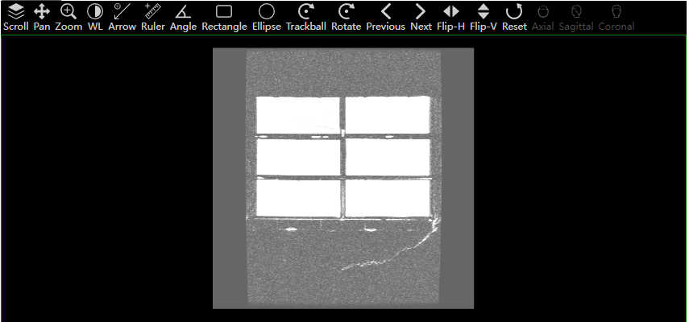
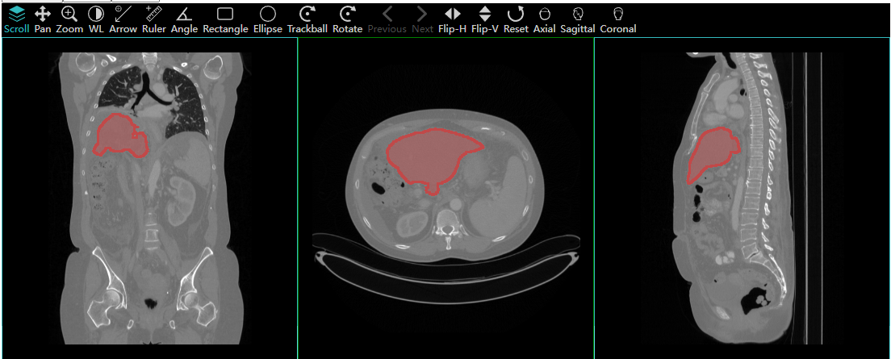
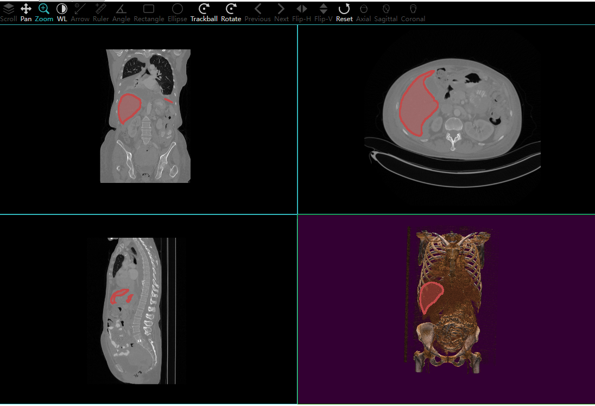

# NgCornerstone

[](https://github.com/prettier/prettier)
[](http://commitizen.github.io/cz-cli/)

This is an angular component for [CornerStone3D](https://www.cornerstonejs.org/)

It can be used as a viewer of DICOM images and NIFTI images.
- Support WADO-RS
- Support Nifti
- Support stack view
- Support MPR view
- Support Volume3D view
- Support segment display
- Tool list is configurable

Integration is need only 3 steps.


## Preview
###stack view

###MPR view

###Volume3D and mpr view


## Integration
1. Run `ng add ng-cornerstone`
2. Edit `angular.json` to import icon sprites files
```
...
"architect": {
  "build": {
      ...
      "assets": [
        ...
        {
          "glob": "**/*",
          "input": "./node_modules/ng-cornerstone/src/assets",
          "output": "/assets/"
        }
...
```
3. Import ViewerModule and nc-viewer

```ts
@NgModule({
  imports: [ViewerModule.forRoot()]
})
```

```html
<nc-viewer
  [toolList]="toolList"
  [imageInfo]="imageInfo"
  [segmentInfo]="segmentInfo"
></nc-viewer>
```

## Configuration

### ToolList support follow tools:  
- AngleTool,
- ArrowAnnotateTool,
- EllipticalROITool,
- LengthTool,
- PanTool,
- RectangleROITool,
- StackScrollTool,
- TrackballRotateTool,
- WindowLevelTool,
- ZoomTool
- FlipV
- FlipH, 
- Rotate
- Next
- Previous
- Coronal
- Axial
- Sagittal

### ImageInfo 
should provide studyInstanceUID, seriesInstanceUID, urlRoot, viewportType, schema
like:
#### Orthographic and WADO-RS
```
{
  studyInstanceUID: '1.3.6.1.4.1.14519.5.2.1.7009.2403.334240657131972136850343327463',
  seriesInstanceUID: '1.3.6.1.4.1.14519.5.2.1.7009.2403.226151125820845824875394858561',
  urlRoot: 'https://d1qmxk7r72ysft.cloudfront.net/dicomweb',
  viewportType: Enums.ViewportType.ORTHOGRAPHIC,
  schema: RequestSchema.WadoRs,
}
```

#### Volume3D
```js
{
  viewportType: Enums.ViewportType.VOLUME_3D
}
```

#### Nifti 
```ts
    imageInfos = [{
      studyInstanceUID: '1.2.392.200055.5.4.80861305518.20150928153455671288',
      seriesInstanceUID: '1.2.392.200036.9142.10002202.1020869001.2.20150928174647.30151',
      urlRoot: 'http://example.com/ABD_LYMPH_006/fe0ace7a-b70a-43bc-9eb0-52359b4d2241/Images/ABD_LYMPH_006.nii',
      // urlRoot: 'http://example.com/ABD_LYMPH_006/fe0ace7a-b70a-43bc-9eb0-52359b4d2241/Images/ABD_LYMPH_006.nii.gz',
      viewportType: Enums.ViewportType.VOLUME_3D,
      // viewportType: Enums.ViewportType.ORTHOGRAPHIC,
      schema: RequestSchema.nifti,
    }]
```

#### Segment

Segment is same type with ImageInfo but segmentType.
segmentType only support labelMap now.
Surface and Contour is in develop
```ts
    imageInfos = [{
        segmentType: csToolEnum.SegmentationRepresentations.Labelmap,
    }]
```

## Troubleshooting

### ng serve failed, try to edit tsconfig.json

```json
{
  "compilerOptions": {
    "skipLibCheck": true
  }
}
```

### Enable WASM

To enable dynamic-import cornerstoneWADOImageLoader, you can use `@angular-builders/custom-webpack`.
The angular json should like:

```
"architect": {
  "build": {
    "builder": "@angular-builders/custom-webpack:browser",
    "options": {
      "customWebpackConfig": {
        "path": "./extra-webpack.config.js",
        "mergeRules": {
          "externals": "replace"
        }
      },
      "assets": [
        ...
        {
        "glob": "**/*",
        "input": "./node_modules/@cornerstonejs/dicom-image-loader/dist/dynamic-import",
        "output": "/"
        }
      ]
    }
  }
}
```

extra-webpack.config.js should like:

```js
module.exports = {
  resolve: {
    // We use this alias and the CopyPlugin below to support using the dynamic-import version
    // of WADO Image Loader, but only when building a PWA. When we build a package, we must use the
    // bundled version of WADO Image Loader so we can produce a single file for the viewer.
    // (Note: script-tag version of the viewer will no longer be supported in OHIF v3)
    alias: {
      '@cornerstonejs/dicom-image-loader':
        '@cornerstonejs/dicom-image-loader/dist/dynamic-import/cornerstoneDICOMImageLoader.min.js',
    },
  },
};
```

For more detail, refer to [here](https://github.com/cornerstonejs/cornerstoneWADOImageLoader#upgrade-to-cwil-v4x)

### Enable SharedBufferArray

Edit `angular.json` add two headers:

```
...
"serve": {
  ...
  "options": {
    "host": "0.0.0.0",
    "headers": {
      "Cross-Origin-Embedder-Policy": "require-corp",
      "Cross-Origin-Opener-Policy": "same-origin"
    },
    ...
  },
...

```

You should also add the two header when deploy your app as a product.


## Contribution
1. ng-cornerstone is the library.
2. ncv-example is an example app of ng-cornerstone
3. ng-playground is an angular app depends on @cornerstonejs directly.
